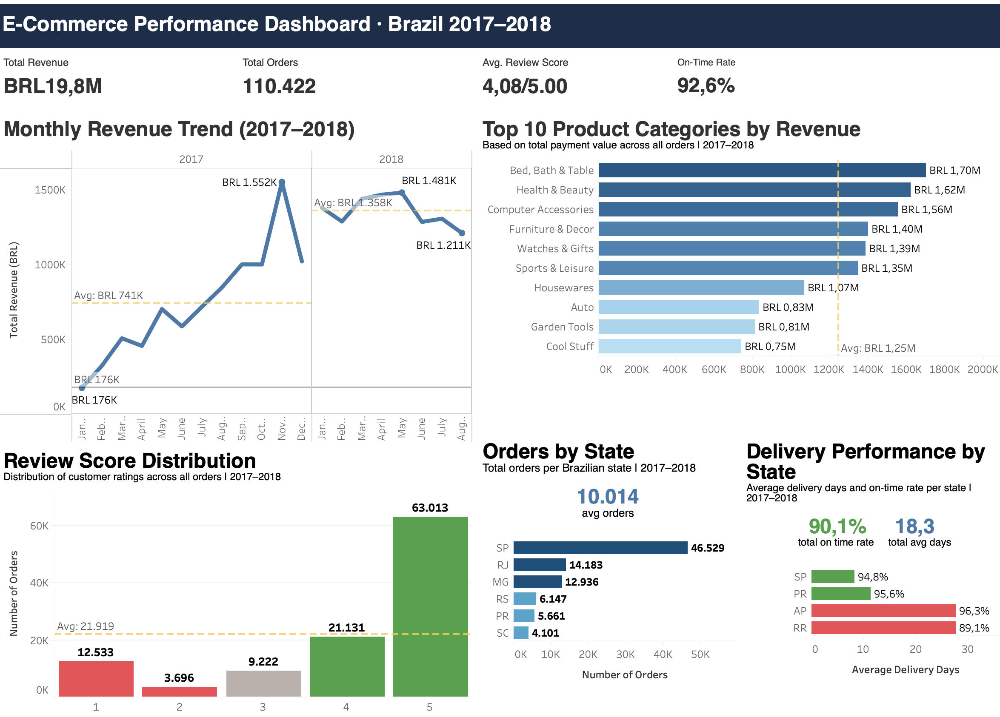

# 🛒 E-Commerce Performance Analysis | Brazil 2017–2018

> **A data analyst portfolio project analyzing Brazilian e-commerce transactions using Python (Jupyter Notebook) and Tableau. The dataset covers 110,000+ orders across 2017–2018, exploring revenue trends, product performance, customer satisfaction, and delivery efficiency.**

---

## 🗂️ Table of Contents

- [Overview](#overview)
- [Dataset](#dataset)
- [Business Questions](#business-questions)
- [Dashboard Preview](#dashboard-preview)
- [Key Findings](#key-findings)
- [Project Structure](#project-structure)
- [How to Run](#how-to-run)
- [Tools](#tools)
- [About](#about)

---

## Overview
End-to-end exploratory data analysis of Brazilian e-commerce transactions from Olist (2017–2018), covering revenue trends, product performance, customer satisfaction, and delivery efficiency across 110.042 orders.

This project demonstrates full data analytics workflow:
data cleaning → EDA → visualization → business insight.

---

## Dataset

- **Source:** [Brazilian E-Commerce Public Dataset by Olist](https://www.kaggle.com/datasets/olistbr/brazilian-ecommerce) — Kaggle
- **Period:** January 2017 – August 2018
- **Records:** 110,422 orders
- **Key fields:** `order_id`, `payment_value`, `review_score`, `order_status`, `customer_state`, `delivery_date`

---

## Business Questions

1. **How did monthly revenue trend from 2017–2018?**
2. **Which product categories drove the most sales?**
3. **What is the customer satisfaction distribution?**
4. **Which states generated the most orders?**
5. **How efficient was the delivery process?**

---

## Dashboard Preview

🔗 [View on Tableau Public](https://public.tableau.com/app/profile/fatwa.nurhidayat/viz/E-CommercePeformanceDashboard/E-CommerceSalesAnalysisDashboard) 



---

## Key Findings

| # | Question | Finding |
|---|----------|---------|
| 1 | Revenue Trend | Revenue grew steadily throughout 2017, peaking at **BRL 1.55M** in Nov 2017, with a slight decline into mid-2018 |
| 2 | Top Categories | **Bed, Bath & Table** led with BRL 1.70M, followed by Health & Beauty (1.62M) and Computer Accessories (1.56M) |
| 3 | Customer Satisfaction | **63,013 orders (57%)** rated 5/5 — overall avg score **4.08/5.00**, indicating high satisfaction |
| 4 | Orders by State | **São Paulo (SP)** dominates with 46,529 orders, followed by RJ (14,183) and MG (12,936) |
| 5 | Delivery Efficiency | On-time rate of **92.6%** overall; SP delivers in ~8 days while remote states like AM/RR average 25–28 days |

---

## Project Structure

```
e-commerce-analysis/
│
├── assets/
│   └── dashboard_preview.png
│
├── dashboard/
│   └── e-commerce peformance dashboard.twbx                          # Tableau workbook                   
│
├── notebook/
│   └── ecommerce-sales-analysis.ipynb                                # Data cleaning, EDA, feature engineering  
│
├── tableau/
│   └── tableau_master.csv                                            # Cleaned dataset used for Tableau
│
├── README.md
└── requirements.txt
```

---

## How to Run

1. Clone the repository
   ```bash
   git clone https://github.com/fatwanurhdyt/E-Commerce-Analysis.git
   cd e-commerce-analysis
   ```

2. Install dependencies
   ```bash
   pip install pandas matplotlib seaborn jupyter
   ```

3. Open the notebook
   ```bash
   jupyter notebook notebook/ecommerce_analysis.ipynb
   ```

4. For the dashboard, open `tableau_master.csv` in Tableau or visit the Tableau Public link above.

---

## Tools

| Tool | Purpose |
|------|---------|
| Python (Pandas, Matplotlib, Seaborn) | Data cleaning & EDA |
| Jupyter Notebook | Analysis & documentation |
| Tableau Public | Interactive dashboard |
| GitHub | Version control & portfolio hosting |

---

## Author

**Fatwa Nurhidayat**
- GitHub: [@fatwanurhdyt](https://github.com/fatwanurhdyt)
- LinkedIn: [linkedin.com/in/fatwanurhdyt](https://linkedin.com/in/fatwanurhdyt)
- Email: [fatwa.nrhdyt@gmail.com](mailto:fatwa.nrhdyt@gmail.com)
